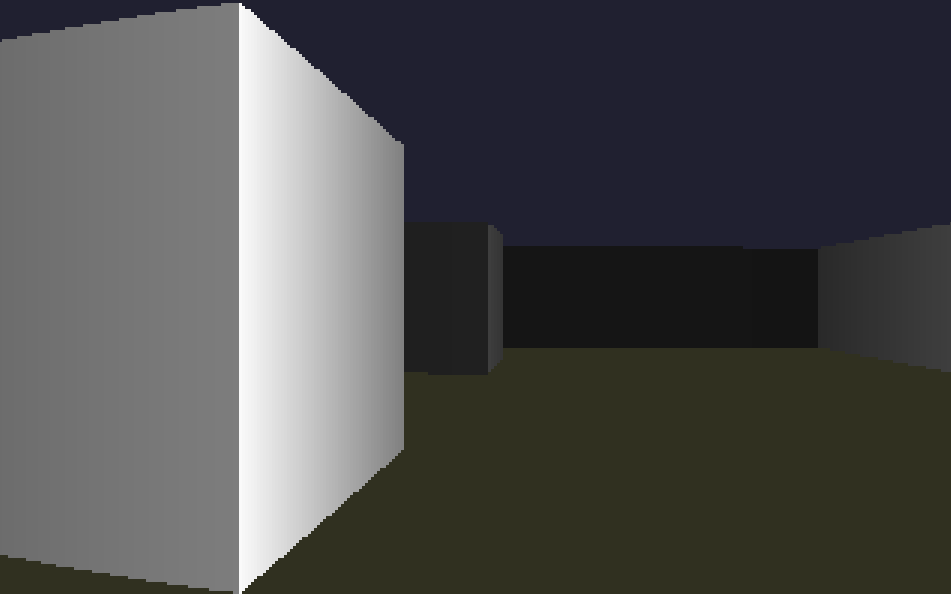

# Raycast

A classic raycasting engine written in Rust, implementing a Wolfenstein 3D-style first-person renderer from scratch.

<div align="center">
  
</div>

## Features

- **DDA Raycasting Algorithm**: Uses Digital Differential Analysis for efficient wall collision detection
- **Real-time Rendering**: 320x200 resolution scaled up 3x, rendered at 60fps using GPU-accelerated pixel buffers
- **First-Person Controls**: WASD or arrow keys to navigate the maze
- **Distance Shading**: Walls darken with distance for depth perception
- **Side Shading**: Different wall orientations (N/S vs E/W) render with different brightness for visual clarity
- **Collision Detection**: Player cannot walk through walls (axis-aligned sliding)

## How It Works

### Architecture

```
main.rs       → Window creation via winit, event loop, input handling
map.rs        → Static 8x8 maze layout, wall query function
player.rs     → Player position/angle state, movement with collision
raycast.rs    → DDA (Digital Differential Analysis) ray-wall intersection
render.rs     → Frame buffer rendering: ceil, floor, wall columns, shading
```

### Raycasting Pipeline

1. **For each horizontal pixel column** (0 to 319):
   - Calculate ray angle within a 60° FOV
   - Cast ray using DDA algorithm to find nearest wall
   - Compute perpendicular distance (avoids fisheye distortion)

2. **Draw vertical wall column**:
   - Height = viewport_height / perpendicular_distance
   - Color shaded by distance and wall side (E/W walls are darker)

3. **Background**:
   - Ceiling: dark blue (#202030)
   - Floor: dark olive (#303020)

### DDA Algorithm

The raycaster steps through grid cells incrementally, comparing accumulated side distances (`side_dist_x` vs `side_dist_y`) to determine which wall face is hit first. This guarantees finding the closest wall intersection without testing every cell.

### Rendering

Uses the `pixels` crate for a simple GPU-accelerated frame buffer. The frame is an RGBA byte array (320×200×4 bytes), updated each frame and displayed via `winit`'s windowing system.

## Building

```bash
cargo build
```

## Running

```bash
cargo run
```

## Controls

| Key | Action |
|-----|--------|
| `W` / `↑` | Move forward |
| `S` / `↓` | Move backward |
| `A` / `←` | Turn left |
| `D` / `→` | Turn right |
| `Escape` | Quit |

## Map

The default map is an 8×8 grid with a central pillar structure:

```
########
#......#
#..##..#
#......#
#......#
#..##..#
#......#
########
```

- `#` = wall
- `.` = empty space

Edit `src/map.rs` to create your own layouts.

## Dependencies

- **winit 0.30** — Cross-platform window creation and input
- **pixels 0.17** — Simple GPU-accelerated 2D pixel renderer

## License

This project is for educational purposes — a hands-on exploration of raycasting fundamentals in Rust.
